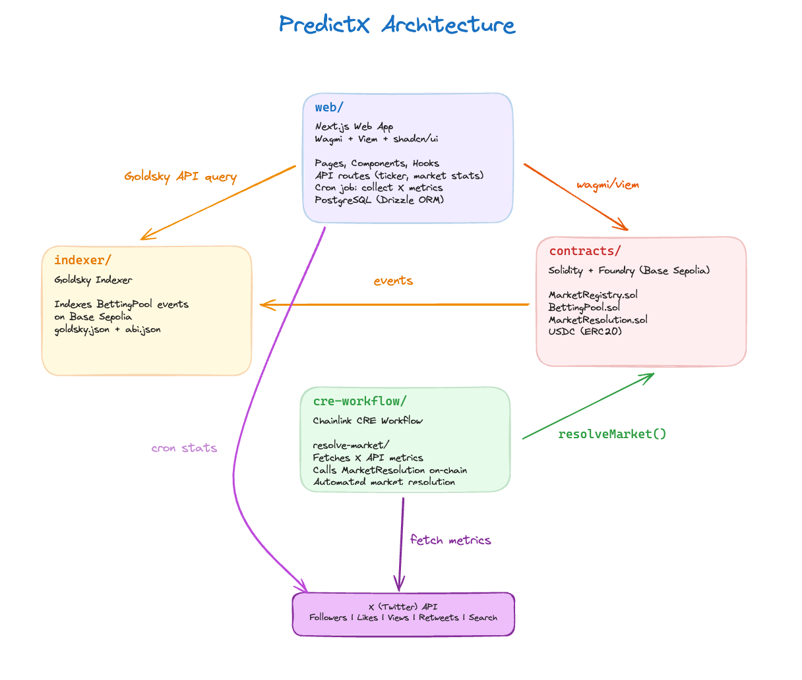

# PredictX

Onchain prediction market on Base Sepolia. Users create markets around X (Twitter) metrics, place USDC bets, and markets are automatically resolved via Chainlink CRE workflows.

**Live App:** https://predictx-sandy.vercel.app/



## Project Structure

| Folder | Description | Details |
|--------|-------------|---------|
| [`web/`](./web/) | Next.js frontend with wagmi/viem, admin panel, and cron-based stats collection | [web/README.md](./web/README.md) |
| [`contracts/`](./contracts/) | Solidity smart contracts (Foundry) - MarketRegistry, BettingPool, MarketResolution | [contracts/](./contracts/) |
| [`cre-workflow/`](./cre-workflow/) | Chainlink CRE workflow for automated market resolution via DON consensus | [cre-workflow/](./cre-workflow/) |
| [`indexer/`](./indexer/) | Goldsky indexer for BettingPool events on Base Sepolia | [indexer/](./indexer/) |


## How It Works

1. **Admin creates a market** tied to an X metric (followers, likes, views, retweets, search count) with a target value and deadline
2. **Users place USDC bets** (Yes/No) on whether the metric will hit the target
3. **Chainlink CRE workflow** automatically resolves markets by fetching X API data with DON consensus and submitting signed reports on-chain
4. **Goldsky indexes** BettingPool events for efficient querying by the web app
5. **Winners claim** their proportional share of the pool

## Quick Start

### Prerequisites

- [Node.js](https://nodejs.org/) + [pnpm](https://pnpm.io/)
- [Foundry](https://book.getfoundry.sh/) for contracts
- [Bun](https://bun.sh/) for CRE workflow

### Setup

```bash
pnpm install

# copy env files and fill in values
cp web/.env.local.example web/.env.local
```

### Run

```bash
# dev server
pnpm dev

# contract tests
pnpm test:contracts

# deploy contracts
pnpm deploy:contracts


```

### CRE Workflow

```bash
cd cre-workflow/resolve-market
bun install

# simulate and broadcast resolution
cre workflow simulate --target=staging-settings --broadcast
```

See [Chainlink CRE docs](https://docs.chain.link/) for deploying workflows to the DON.

## Environment Variables

<details>
<summary><code>web/.env.local</code></summary>

| Variable | Description |
|----------|-------------|
| `NEXT_PUBLIC_WALLETCONNECT_PROJECT_ID` | WalletConnect / Reown project ID |
| `NEXT_PUBLIC_MARKET_REGISTRY` | Deployed MarketRegistry address |
| `NEXT_PUBLIC_BETTING_POOL` | Deployed BettingPool address |
| `NEXT_PUBLIC_MARKET_RESOLUTION` | Deployed MarketResolution address |
| `DATABASE_URL` | Neon Postgres connection string |
| `TWITTER_BEARER_TOKEN` | X API v2 bearer token |
| `CRON_SECRET` | Secret for cron job auth |

</details>

<details>
<summary><code>cre-workflow/.env</code></summary>

| Variable | Description |
|----------|-------------|
| `CRE_ETH_PRIVATE_KEY` | Private key for CRE workflow |
| `CRE_TARGET` | Target (`staging-settings` or `production-settings`) |
| `X_API_BEARER_TOKEN` | X API bearer token for DON nodes |

</details>
